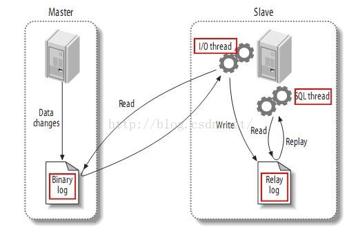

数据库

- 应用读多写少
- 写数据慢，读数据快

如果我们把写数据库的少且慢的操作与读数据库的多且快的操作分离开，很容易提升数据库的性能。总体来说还是应用了服务分离的特性，将一个总体的大的操作分开成为几个小的操作，从而提升系统的瓶颈

方案

- 应用层解决

> 一种可行的方式是通过Spring动态数据源和AOP解决数据库的读写分离，DynamicDataSource。如果是使用Spring的应用层数据解决问题的话，应该仔细考虑到可能的各种情况，特别是主从复制过程中的延迟，需要根据场景实现
>
> 优点是不需要引入额外的中间件

- 使用中间件，比如 mysql-proxy ，或者 Amoeba for Mysql

> 有点事不需要对现有程序做任何改动，还可以动态的添加数据源，但是由于中间件做了中转代理，所以性能有所下降，同样需要复制过程中的延迟，根据业务判断此延迟是否影响到业务

MySql主从复制

> 1，master将数据改变记录到二进制日志中
>
> 2，slave将master的二进制日志copy到它的中继日志中
>
> 3，slave重演中继日志中的事件

**日志记录模式**

- sql模式：记录sql语句，数据量不大，复合编程思维

> 但是有些函数和特定环境相关，比如时间生成函数；slave里如果被删除了一条记录，有可能自增长id字段会和master不一致

- row模式：记录表中发生改变的行的数据，不需要考虑特定环境相关的函数问题

> 但是有时候数据量太多，比如插入一个新列，会记录所有表中的行

- mix模式：择优使用sql模式或者row模式

> 比如alert table使用sql模式，而insert数据使用row模式。

**读取一致性**

- 最终一致性读取 

> 写入数据后读取数据，响应反应的可能不是刚刚完成的写入操作结果，而是一些旧数据，在一段时间后，将会返回新数据

- 强一致性读取

> 只要是读取的数据，响应返回的都将是最新数据

