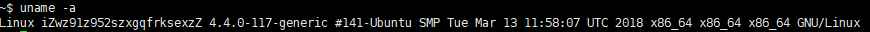

系统信息：



1，添加用户

`adduser：创建用户主目录    `

`useradd：不创建用户主目录`

使用adduser，输入用户名以及密码，成功创建

2，使用户具有管理员权限

 `vim /etc/sudoers` 

```
# User privilege specification
root    ALL=(ALL:ALL) ALL
songlin All=(ALL) ALL
```


