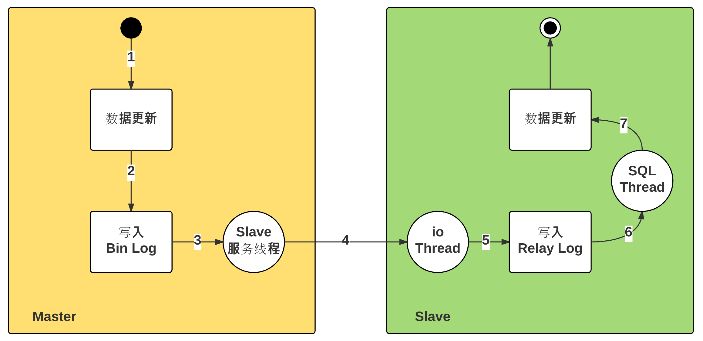

**涉及点**

- 通信

> 二进制传输协议，使用protobuf编解码需要传输的数据

- 存储

> 内存数据库，使用ConcurrentHashMap

- 高可用

> 实现分布式，使用一致性哈希算法作为负载均衡保证，但还需要考虑选举中心节点的问题。
>
> 这里可以考虑两种方法实现分布式
>
> - 使用一个查询组件作为查询服务器，但是如果这个组件挂掉了，整个系统将不可用，且存在系统瓶颈
> - 使用选举算法

- 高并发

> 涉及到的部分真的很多，有许多都需要从根本上理解相关的只是


**实现**

1. 通信使用Google protobuf进行数据传输

2. 协议使用socket协议

3. 存储使用内存存储，使用ConcurrentHashMap

4. 持久化，待实现

   > 通过日志重放以及内存数据持久化完成数据的保存，日志初始版本是0，每次修改则添加版本号为1

5. 分布式，待实现

6. 高可用

   > 通过在写的时候同步数据到从redis，可以实现数据的


下一步任务

- 实现内存快照+日志记录的方法作为重放日志记录的保证
- 启动master的副本策略，使slave注册mater，使用心跳保证副本存活，并实现slave启动时请求交互流程


数据格式：

- 数据存取请求

```protobuf
message RobinRequest {
  required int32 type = 1;
  required string key = 2;
  optional bytes content = 3;
}

message RobinResponse {
  required int32 type = 1;
  optional bytes content = 2;
}
```

- 日志存储格式：   版本+请求记录

```protobuf
message RonbinRecord {
  message RobinRequest {
    required int32 type = 1;
    required string key = 2;
    optional bytes content = 3;
  }
  required int64 version = 1;
  required RobinRequest request = 2;
}
```

- slave请求数据同步格式 

```protobuf
message SlaveRequest {
  required int64 version = 1;
}

message SlaveResponse {
  message RobinRequest {
    required int32 type = 1;
    required string key = 2;
    optional bytes content = 3;
  }
  required int64 version = 1;
  required int32 op = 2;
  repeated RobinRequest data = 3;
}
```


启动启动格式

使用config文件标记自己是master还是slave


1. 启动时候读取本地日志文件进行重放，并记录下当前的版本号
2. master启动线程监听slave的心跳检测，心跳检测更新slave数据，用于推送数据，注意心跳存在不作为心跳增加时应该启动数据同步过程，心跳失败
3. slave启动时请求master的数据同步过程，
4. master推送数据到slave


slave启动的时候同步请求数据时





- 主从延迟：「步骤2」开始，到「步骤7」执行结束。
- 步骤 2：存储引擎处理，时间极短
- 步骤 3：文件更新通知，磁盘读取延迟
- 步骤 4：Bin Log 文件更新的传输延迟，单线程
- 步骤 5：磁盘写入延迟
- 步骤 6：文件更新通知，磁盘读取延迟
- 步骤 7：SQL 执行时长

