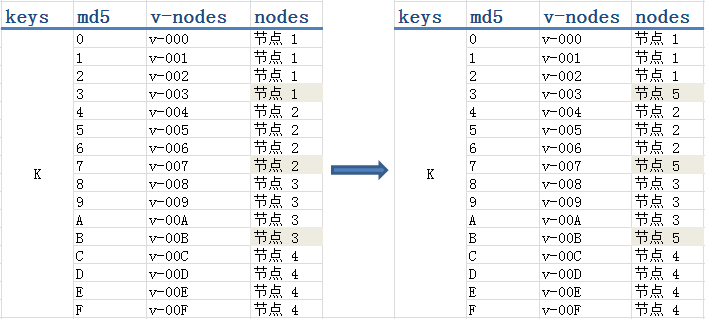

一致哈希的基本思想是使用相同的哈希函数将缓存和对象映射到相同的哈希空间。


> 一致性hash算法可以保证当一个节点被移除时，只有这个节点中的对象会被rehash。当增加一个节点时，只有相当少的对象会被重新散列


哈希算法

```
hash(0) mod n
增加一个节点：hash(o) mod (n+1)
减少一个节点：hash(o) mod (n-1)
```

> 可以预见几乎所有的对象都会被重新映射到一个新的机器上


- 哈希空间

> 通常一个hash函数将映射一个值到0~(2^32-1)之间，将2^32-1的下一节点想象成是0

- 对象映射到哈希空间

> ```
> hash(object1) = key1;
> ...
> hash(object4) = key4;
> ```

- 将节点映射到哈希空间

> ```
> hash(cache A) = key A;
> hash(cache B) = key B;
> hash(cache C) = key C;
> ```

- 将对象存储到节点

> 通过对比对象的hash值，将其放在大于其key值的最近节点。

- 移除节点

> 当移除一个节点时，该节点的所有数据将会被rehash到下一个节点

- 添加节点

> 当添加一个节点时，该节点所在位置本来所属的节点中的对象，只有小于添加节点hash值的数据会被映射到新的节点


通常一致性hash算法会存在节点数据不均衡的问题，这种问题可以通过虚节点解决。

- 添加节点

> 当添加一个实际的节点时，会给这个节点添加一些虚拟节点

- 删除节点

> 从哈希空间中删除这个节点的所有虚拟节点



添加新的节点的时候，将现有节点的每一部分数据添加到新的机器中，删除节点的时候，将删除节点的数据再rehash到其它的节点。


另外需要考虑到热点数据，如果对某一个对象发生巨大的请求，单机无法负载，应该如何考虑？

> 直观的做法肯定是，使用多个节点存储该热点数据，使用负载均衡保证数据响应。通过分布于各地的机房各自分担区域请求的做法。