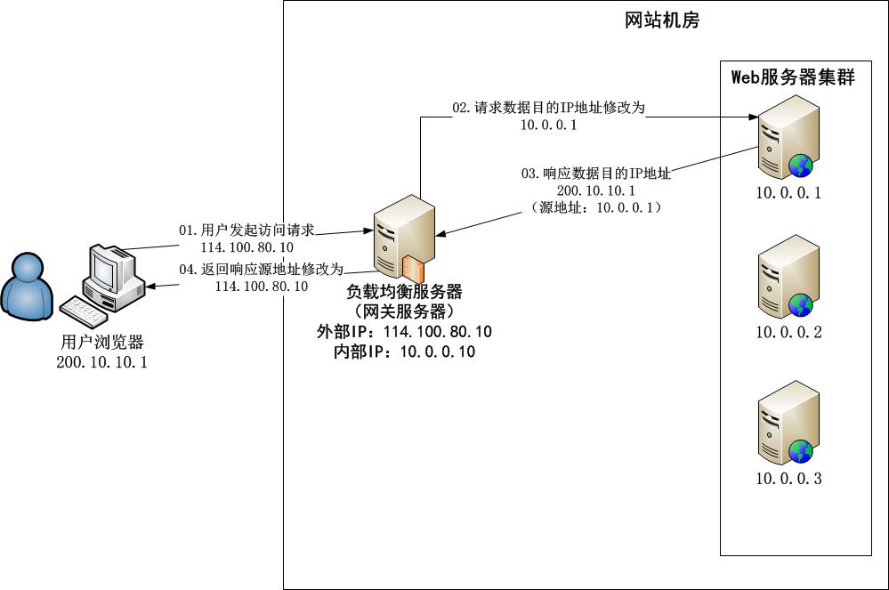
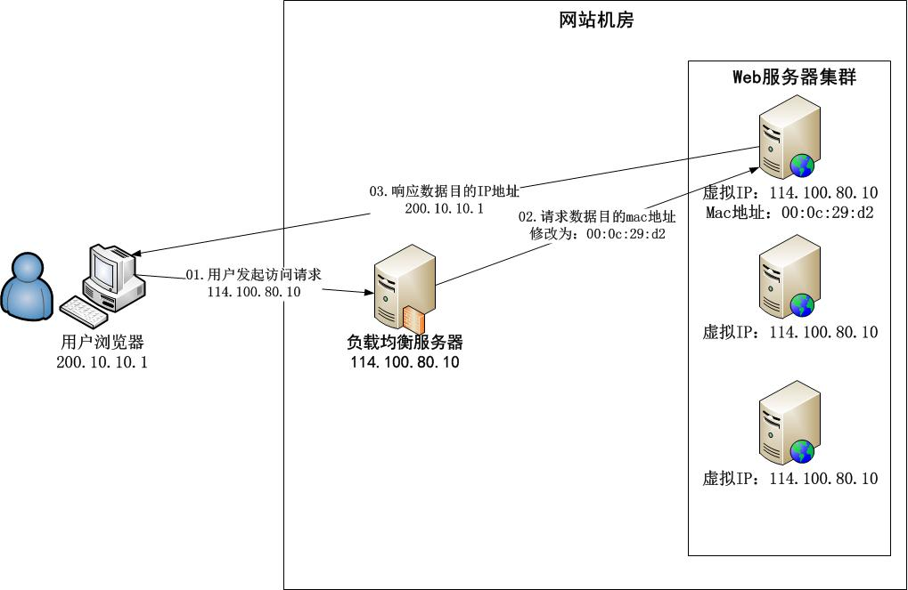
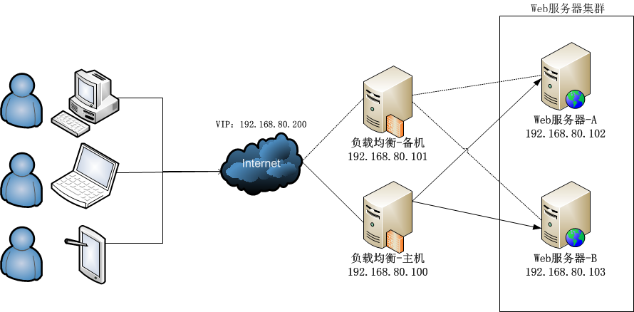

#### 使用LVS体系架构

1. 最前端的负载均衡层（Load Balancer）
2. 中间的服务器集群层（Server Array）
3. 最底层的数据共享存储层（Shared Storage）

#### 转发机制

- NET模式：网络地址转换

- DR模式：直接路由

#### LVS+Keepalived实现负载均衡

###### 

通过在两台服务器上部署两套LVS负载均衡，同时使用Keepalived对负载均衡做主备。实现了负载均衡高可用

